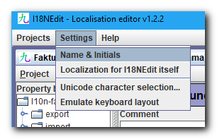

### Erstellen oder Aktualisieren einer Übersetzungsdatei für Fakturama

Das Format bzw. das Programm, mit dem man die Übersetzung anfertigt, haben sich geändert. Das neue Hilfsmittel heißt "i18nedit" und ist bereits steinalt. Aber es funktioniert :-) Damit ihr gleich loslegen könnt, habe ich ein paar Dinge vorbereitet. Folgende Schritte wären zu tun:

* [i18nedit](http://files.fakturama.info/dev/i18nedit.jar) von unserer Homepage herunterladen
* [Fakturama Sprachdateien](http://files.fakturama.info/dev/current_i18n-fakturama.zip) herunterladen und in ein Arbeitsverzeichnis entpacken (Hinweis: in dem ZIP file befinden sich sämtliche Sprachdateien für alle Plugins)

Die I18N-Dateien stammen aus folgenden Bundles:

* `com.sebulli.fakturama.rcp`
* `org.fakturama.export`
* `org.fakturama.import`
* `org.fakturama.exporter.zugferd`

Die Sprachdateien befinden sich immer unterhalb des Verzeichnisses `OSGI-INF/l10n`.

Nun die Datei i18nedit.jar doppelt anklicken, damit öffnet sich ein leeres Programmfenster. Öffne ein Projekt (_Projekte &rarr; Projekt öffnen_) und wähle die Datei `i18nedit.properties` aus dem Arbeitsverzeichnis aus. Über _Projekt &rarr; Anzuzeigende Lokalisation wählen_ (Achtung: Bitte den Unterschied zwischen _Projekte_ und _Projekt_ in den unterschiedlichen Menüleisten beachten!)

kannst Du die Sprachen auswählen, die Du sehen möchtest:

Bitte gib Deinen Namen und Deine Initialien ein:

Wenn Du die Sprache der Obefläche selbst umschalten möchtest kannst Du das über das Menü _Einstellungen_ erledigen.

Nun sollte das Programmfenster in etwa so aussehen (die Infos unter "Ressource" bekommt ihr erst angezeigt, wenn ihr ganz links einen Eintrag auswählt (z. B. _"rcp/bundle"_)):

Nun kannst Du auf den Eintrag (1) klicken, um das entsprechende Bundle auszuwählen. Dann wählst Du den konkreten Eintrag (2) aus und kannst dessen Übersetzungen (3) anzeigen und ändern. Bei Bedarf kannst Du über dem Eintrag auch einen Kommentar hinterlassen. Dieser wird in einer separaten Datei gespeichert.

Nun kannst Du die einzelnen Einträge durchgehen und schauen, ob die noch so stimmen oder ob da evtl. etwas anderes stehen müßte. Orientiert euch dabei bitte an den deutschen bzw. englischen Begriffen. Wenn ihr Fragen habt, scheut euch bitte nicht, [mich](mailto:ralf.heydenreich@fakturama.info) anzusprechen. 

Bei Bedarf könnt ihr in der [Onlinedokumentation](http://files.fakturama.info/dev/i18nedit-help/onepagehtml) nachlesen oder diese auch als [PDF](http://files.fakturama.info/dev/I18NEdit.pdf) herunterladen. 

Wenn Du mit der Übersetzung fertig bist kannst Du das komplette Arbeitsverzeichnis einfach in ein ZIP-File verpacken und per [E-Mail](mailto:ralf.heydenreich@fakturama.info) an mich schicken. Alternativ kann ich Dir auch einen Zugang im Git anlegen, dann kannst Du das direkt hochladen.

Vorab schon mal vielen Dank für Deine Hilfe. Wenn Du nichts dagegen hast, würde ich Deinen Namen in der _About box_ unter der Rubrik _Übersetzer_ mit aufführen.